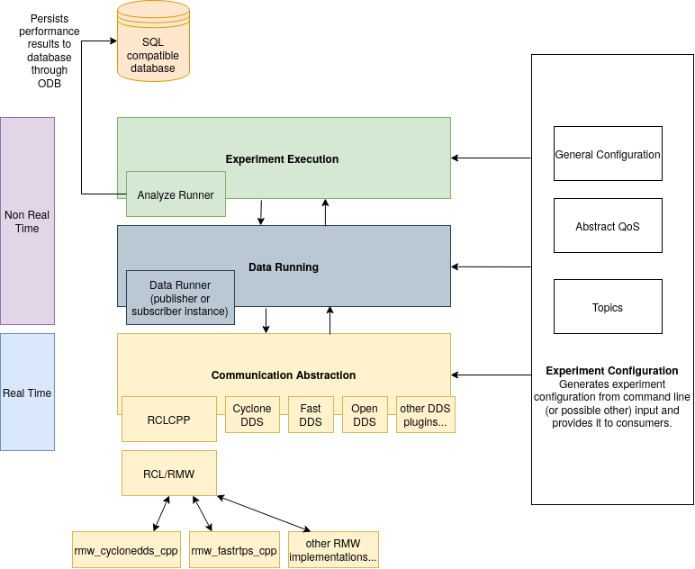

# performance_test

The performance_test tool tests latency and other performance metrics of [various middleware
implementations](#middleware-plugins) that support a pub/sub pattern. It is used to simulate
non-functional performance of your application.

The performance_test tool allows you to quickly set up a pub/sub configuration,
e.g. number of publisher/subscribers, message size, QOS settings, middleware. The following metrics
are automatically recorded when the application is running:

- **latency**: corresponds to the time a message takes to travel from a publisher to subscriber. The
  latency is measured by timestamping the sample when it's published and subtracting the timestamp
  (from the sample) from the measured time when the sample arrives at the subscriber.
- **CPU usage**: percentage of the total system wide CPU usage
- **resident memory**: heap allocations, shared memory segments, stack (used for system's internal
  work).
- **sample statistics**: number of samples received, sent, and lost per experiment run.

## How to use this document

1. Start [here](#example) for a quick example of building and running the performance_test tool
   with the Cyclone DDS plugin.
2. If needed, find more detailed information about [building](#building-the-performance_test-tool)
   and [running](#running-an-experiment)
3. Or, if the quick example is good enough, skip ahead to the [list of supported middleware
   plugins](#middleware-plugins) to learn how to test a specific middleware implementation.
4. Check out the [tools for visualizing the results](#analyze-the-results)
5. If desired, read about the [design and architecture](#architecture) of the tool.

## Example

This example shows how to test the non-functional performance of the following configuration:

| Option                     | Value       |
|----------------------------|-------------|
| Plugin                     | Cyclone DDS |
| Message type               | Array1k     |
| Publishing rate            | 100Hz       |
| Topic name                 | test_topic  |
| Duration of the experiment | 30s         |

1. Install [ROS 2](https://docs.ros.org/en/foxy/index.html)

2. Install [Cyclone DDS](https://github.com/eclipse-cyclonedds/cyclonedds) to /opt/cyclonedds

3. Build performance_test with the [CMake build flag](#eclipse-cyclone-dds) for Cyclone DDS:

```bash
source /opt/ros/foxy/setup.bash
cd ~/perf_test_ws
colcon build --cmake-args -DPERFORMANCE_TEST_CYCLONEDDS_ENABLED=ON
source ./install/setup.bash
```

4. Run with the [communication plugin option](#eclipse-cyclone-dds) for Cyclone DDS:

```bash
mkdir experiment
./install/performance_test/lib/performance_test/perf_test --communication CycloneDDS
                                                          --msg Array1k
                                                          --rate 100
                                                          --topic test_topic
                                                          --max_runtime 30
                                                          --logfile experiment/log
```

At the end of the experiment, a CSV log file will be generated in the experiment folder with a name
that starts with `log`.

## Building the performance_test tool

For a simple example, see [Dockerfile.ROS2](dockerfiles/Dockerfile.ROS2).

The performance_test tool is structured as a ROS 2 package, so `colcon` is used to build it.
Therefore, you must source a ROS 2 installation:

```bash
source /opt/ros/foxy/setup.bash
# or use Apex.OS in ade:
source /opt/ApexOS/setup.bash
```

Select a middleware plugin from [this list](#middleware-plugins).
Then build the performance_test tool with the selected middleware:

```bash
mkdir -p ~/perf_test_ws/src
cd ~/perf_test_ws/src
git clone https://gitlab.com/ApexAI/performance_test.git
cd ..
# At this stage, you need to choose which middleware you want to use
# The list of available flags is described in the middleware plugins section
colcon build --cmake-args -DCMAKE_BUILD_TYPE=Release <cmake_enable_plugin_flag>
source install/setup.bash
```

## Running an experiment

The performance_test experiments are run through the `perf_test` executable.
To find the available settings, run with `--help` (note the required and default arguments):

```bash
~/perf_test_ws$ ./install/performance_test/lib/performance_test/perf_test --help
```

- The `-c` argument should match the selected [middleware plugin](#middleware-plugins)
  from the build phase.
- The `--msg` argument should be one of the supported message types, which can be listed
  by running with `--msg_list`.

### Single machine or distributed system?

Based on the configuration you want to test, the usage of the performance_test tool differs. The
different possibilities are explained below.

For running tests on a single machine, you can choose between the following options:

1. Intraprocess means that the publisher and subscriber threads are in the same process.
   This is the default configuration.
1. Interprocess means that the publisher and subscriber are in different processes. To test
   interprocess communication, two instances of the performance_test must be run, e.g.

    ```bash
    perf_test <options> --num_sub_threads 0 --num_pub_threads 1 &
    perf_test <options> --num_sub_threads 1 --num_pub_threads 0
    ```

    1. :point_up: CPU and Resident Memory measurements are logged separately for the publisher and
       subscriber processes.
    1. Latency is only logged for the subscriber process, because it is calculated after the
       sample is received.
    1. Some plugins also support zero copy transfer. With zero copy transfer, the publisher
       requests a loan from a pre-allocated shared memory pool, where it writes the sample. The
       subscriber reads the sample from that same location. When running, use the `--zero_copy`
       argument for both the publisher and subscriber processes.
    1. :memo: The transport is dependent on the middleware

On a distributed system, testing latency is difficult, because the clocks are probably not
perfectly synchronized between the two devices. To work around this, the performance_test tool
supports relay mode, which allows for a round-trip style of communication:

```bash
# On the main machine
perf_test <options> --roundtrip_mode Main

# On the relay machine:
perf_test <options> --roundtrip_mode Relay
```

In relay mode, the Main machine sends messages to the Relay machine, which immediately sends the
messages back. The Main machine receives the relayed message, and reports the round-trip latency.
Therefore, the reported latency will be roughly double the latency compared to the latency reported
in non-relay mode.

## Middleware plugins

### Native plugins

The performance test tool can measure the performance of a variety of communication solutions
from different vendors. In this case there is no [rclcpp or rmw
layer](http://docs.ros2.org/beta2/developer_overview.html#internal-api-architecture-overview)
overhead over the publisher and subscriber routines. The following plugins are currently
implemented:

#### Eclipse Cyclone DDS

- [Eclipse Cyclone DDS 0.8.0beta5](https://github.com/eclipse-cyclonedds/cyclonedds/tree/0.8.0beta5)
- CMake build flag: `-DPERFORMANCE_TEST_CYCLONEDDS_ENABLED=ON`
- Communication plugin: `-c CycloneDDS`
- Zero copy transport (`--zero_copy`): yes
  - Cyclone DDS zero copy requires the
    [runtime switch](https://github.com/eclipse-cyclonedds/cyclonedds/blob/iceoryx/docs/manual/shared_memory.rst)
    to be enabled.
  - Currently, this is only available on the
    [`iceoryx` branch of Cyclone DDS](https://github.com/eclipse-cyclonedds/cyclonedds/tree/iceoryx).
  - If the runtime switch is enabled, but `--zero_copy` is not added, then the plugin will not use
    the loaned sample API, but iceoryx will still transport the samples.
  - See [Dockerfile.mashup](dockerfiles/Dockerfile.mashup)
- Docker file: [Dockerfile.CycloneDDS](dockerfiles/Dockerfile.CycloneDDS)
- Default transports:
  | INTRA | IPC on same machine | Distributed system |
  |-------|---------------------|--------------------|
  | INTRA | UDP                 | UDP                |

#### Eclipse iceoryx

- [iceoryx 1.0](https://github.com/eclipse-iceoryx/iceoryx/tree/release_1.0)
- CMake build flag: `-DPERFORMANCE_TEST_FASTRTPS_ENABLED=ON`
- Communication plugin: `-c iceoryx`
- Zero copy transport (`--zero_copy`): yes
- Docker file: [Dockerfile.iceoryx](dockerfiles/Dockerfile.iceoryx)
- The iceoryx plugin is not a DDS implementation.
  - The DDS-specific options (such as domain ID, durability, and reliability) do not apply.
- To run with the iceoryx plugin,
  [RouDi](https://github.com/eclipse-iceoryx/iceoryx/blob/master/doc/website/getting-started/overview.md#roudi)
  must be running.
  | INTRA     | IPC on same machine | Distributed system                |
  |-----------|---------------------|-----------------------------------|
  | zero copy | zero copy           | Not supported by performance_test |

#### eProsima Fast DDS

- [FastDDS 2.0.x](https://github.com/eProsima/Fast-RTPS/tree/2.0.x)
- CMake build flag: `-DPERFORMANCE_TEST_FASTRTPS_ENABLED=ON`
- Communication plugin: `-c FastRTPS`
- Zero copy transport (`--zero_copy`): no
- Docker file: [Dockerfile.FastDDS](dockerfiles/Dockerfile.FastDDS)
- Default transports:
  | INTRA | IPC on same machine | Distributed system |
  |-------|---------------------|--------------------|
  | UDP   | UDP                 | UDP                |

#### OCI OpenDDS

- [OpenDDS 3.13.2](https://github.com/objectcomputing/OpenDDS/tree/DDS-3.13.2)
- CMake build flag: `-DPERFORMANCE_TEST_FASTRTPS_ENABLED=ON`
- Communication plugin: `-c OpenDDS`
- Zero copy transport (`--zero_copy`): no
- Docker file: [Dockerfile.OpenDDS](dockerfiles/Dockerfile.OpenDDS)
- Default transports:
  | INTRA | IPC on same machine | Distributed system |
  |-------|---------------------|--------------------|
  | TCP   | TCP                 | TCP                |

#### RTI Connext DDS

- [RTI Connext DDS 5.3.1+](https://www.rti.com/products/connext-dds-professional)
- CMake build flag: `-DPERFORMANCE_TEST_CONNEXTDDS_ENABLED=ON`
- Communication plugin: `-c ConnextDDS`
- Zero copy transport (`--zero_copy`): no
- Docker file: Not available
- A license is required
- You need to source an RTI Connext DDS environment.
  - If RTI Connext DDS was installed with ROS 2 (Linux only):
    - `source /opt/rti.com/rti_connext_dds-5.3.1/setenv_ros2rti.bash`
  - If RTI Connext DDS is installed separately, you can source the following script to set the
    environment:
    - `source <connextdds_install_path>/resource/scripts/rtisetenv_<arch>.bash`
- Default transports:
  | INTRA | IPC on same machine | Distributed system |
  |-------|---------------------|--------------------|
  | INTRA | SHMEM               | UDP                |

#### RTI Connext DDS Micro

- [Connext DDS Micro 3.0.3](https://www.rti.com/products/connext-dds-micro)
- CMake build flag: `-DPERFORMANCE_TEST_CONNEXTDDSMICRO_ENABLED=ON`
- Communication plugin: `-c ConnextDDSMicro`
- Zero copy transport (`--zero_copy`): no
- Docker file: Not available
- A license is required
- Default transports:
  | INTRA | IPC on same machine | Distributed system |
  |-------|---------------------|--------------------|
  | INTRA | SHMEM               | UDP                |

### ROS 2 Middleware plugins

The performance test tool can also measure the performance of a variety of RMW implementations,
through the ROS2 `rclcpp::publisher` and `rclcpp::subscriber` API. The following plugins are
currently implemented:

#### ROS 2 Callback Executor

- [ROS 2 `rclcpp::publisher` and `rclcpp::subscriber`](https://docs.ros.org/en/foxy/Tutorials/Writing-A-Simple-Cpp-Publisher-And-Subscriber.html)
- CMake build flag: `-DPERFORMANCE_TEST_CALLBACK_EXECUTOR_ENABLED=ON` (on by default)
- Communication plugin: `-c ROS2`
- Zero copy transport (`--zero_copy`): no
- Docker file: [Dockerfile.ROS2](dockerfiles/Dockerfile.ROS2)
- This plugin will use the ROS 2 RMW implementation that is configured on your system.
  - ROS 2 Foxy is pre-configured to use rmw_fastrtps_cpp.
    - Follow [these instructions](https://docs.ros.org/en/foxy/Guides/Working-with-multiple-RMW-implementations.html)
    to use a different RMW implementation with ROS 2.
    - You can find a list of several other middleware options
      [here](https://docs.ros.org/en/foxy/Concepts/About-Different-Middleware-Vendors.html).
  - Apex.OS is pre-configured to use Apex.Middleware.
    - Apex.OS Cert does not support the ROS 2 Callback Executor. When building performance_test with
      Apex.OS Cert, you must explicitly disable the ROS 2 Callback communicator by setting
      `-DPERFORMANCE_TEST_CALLBACK_EXECUTOR_ENABLED=OFF`.
- Default transports: depends on underlying DDS implementation

#### Apex.OS Polling Subscription

- [Apex.OS Polling Subscription with wait-set](https://apexai.pages.apex.ai/grand_central/docs/latest/using-read-and-take.html)
- CMake build flag: `-DPERFORMANCE_TEST_POLLING_SUBSCRIPTION_ENABLED=ON`
- Communication plugin: `-c ROS2PollingSubscription`
- Zero copy transport (`--zero_copy`): yes
- Docker file: Not available
- Default transports: depends on underlying DDS implementation

## Analyze the results

After an experiment is run with the `-l` flag, a CSV file is recorded. It is possible to add custom
data to the CSV file by setting the`APEX_PERFORMANCE_TEST` environment variable before running an
experiment, e.g.

```json
# JSON format
export APEX_PERFORMANCE_TEST="
{
\"My Version\": \"1.0.4\",
\"My Image Version\": \"5.2\",
\"My OS Version\": \"Ubuntu 16.04\"
}
"
```

It is also possible to save the results in a SQL compatible database.
See [Add SQL support readme](add_sql_support_readme.md) for more info.

### Plot results

The performance_test tool provides several tools to plot the generated results:

1. Results rendered on a PDF file: handy to share results
    
1. Results rendered in a Jupyter notebook: used to compare multiple experiments
    

| RAW Plugin | Supported subscription | Supported transports | `--cmake-args` to pass when building performance_test | Communication mean (-c) to pass when running experiments | Supports zero copy? |
|----------------|------------------------|----------------------|-------------------------------------------------------|----------------------------------------------------------|---------------------|
| [FastDDS 2.0.x](https://github.com/eProsima/Fast-RTPS/tree/2.0.x) | Native DDS Code | UDP | `-DPERFORMANCE_TEST_FASTRTPS_ENABLED=ON` | FastRTPS | No |
| [RTI Connext DDS 5.3.1+](https://www.rti.com/products/connext-dds-professional) <sup>1</sup> | Native DDS Code | SHMEM, UDP | `-DPERFORMANCE_TEST_CONNEXTDDS_ENABLED=ON` | ConnextDDS | No |
| [Connext DDS Micro 3.0.2](https://www.rti.com/products/connext-dds-micro) | Native DDS Code | INTRA, SHMEM | `-DPERFORMANCE_TEST_CONNEXTDDSMICRO_ENABLED=ON` | ConnextDDSMicro | Yes |
| [Eclipse Cyclone DDS](https://github.com/eclipse-cyclonedds/cyclonedds/tree/0.8.0beta5) | Native DDS Code | UDP | `-DPERFORMANCE_TEST_CYCLONEDDS_ENABLED=ON` | CycloneDDS | Yes<sup>2</sup> |
| [OpenDDS 3.13.2](https://github.com/objectcomputing/OpenDDS/tree/DDS-3.13.2) | Native DDS Code | UDP | `-DPERFORMANCE_TEST_OPENDDS_ENABLED=ON` | OpenDDS | No |
| [iceoryx 1.0](https://github.com/eclipse-iceoryx/iceoryx/tree/release_1.0)<sup>3</sup> | iceoryx Posh subscriber | SHMEM | `-DPERFORMANCE_TEST_ICEORYX_ENABLED=ON` | iceoryx | Yes |

The plot tool requires python3 and texlive. On an Ubuntu system you will need to
install the following packages:

`sudo apt-get install python3 python3-pip texlive texlive-pictures texlive-luatex`

Start a Python virtual environment and install the required Python packages:

```bash
cd performance_test/helper_scripts/apex_performance_plotter
pip3 install pipenv
pipenv shell
pipenv install --ignore-pipefile
```

#### Usage

To generate a PDF from the logfile, invoke the `perfplot` binary installed in the previous step:

`perfplot <filename1> <filename2> ...`

Be sure to also check `perfplot -h` for additional options.

>>>
:point_up: **Common Pitfalls**

All of the latency metrics are collected and calculated by the subscriber process.
For interprocess communication, it is recommended to provide different prefixes for
the log files:

```bash
perf_test -c ROS2 --msg Array1k -p 1 -s 0 -l log_pub
perf_test -c ROS2 --msg Array1k -p 0 -s 1 -l log_sub
```

Then, to plot the latency metrics, invoke perfplot on the subscriber's log file.
If perfplot is invoked on the publisher's log file, then the CPU and memory
metrics will be plotted, but the latency plot will be empty.
>>>

To analyze the results in a Jupyter notebook run the following commands:

```bash
pipenv shell
jupyter notebook plot_logs.ipynb

# When you are done, deactivate the venv
deactivate
```

## Architecture

Apex.AI's _Performance Testing in ROS 2_ white paper
([available here](https://drive.google.com/file/d/15nX80RK6aS8abZvQAOnMNUEgh7px9V5S/view))
describes how to design a fair and unbiased performance test, and is the basis for this project.
<center></center>

## Future extensions and limitations

- Communication frameworks like DDS have a huge amount of settings. This tool only allows the most
  common QOS settings to be configured. The other QOS settings are hardcoded in the application.
- Only one publisher per topic is allowed, because the data verification logic does not support
  matching data to the different publishers.
- Some communication plugins can get stuck in their internal loops if too much data is received.
  Figuring out ways around such issues is one of the goals of this tool.
- FastRTPS wait-set does not support timeouts which can lead to the receiving not aborting. In that
  case the performance test must be manually killed.
- Using Connext DDS Micro INTRA transport with `reliable` QoS and history kind set to `keep_all`
  [is not supported with Connext
  Micro](https://community.rti.com/static/documentation/connext-micro/3.0.3/doc/html/usersmanual/transports/INTRA.html#reliability-and-durability).
  Set `keep_last` as QoS history kind always when using `reliable`.

Possible additional communication which could be implemented are:

- Raw UDP communication

## Batch run experiments (for advanced users)

A python script [`run_experiment.py`](helper_scripts/run_experiment.py)
is provided to run multiple experiments at once.
