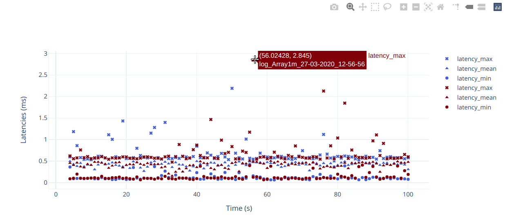

Performance test plotter
========================

Performance plotter create beautiful reports from performance_test logfiles. It
is a python tool that reads the logfiles and renders PDFs using LaTeX.

Installation
------------

This package requires python3 and texlive. On an Ubuntu system you will need to
install the following packages:

::

   sudo apt-get install python3 texlive texlive-pictures texlive-luatex

Once all dependencies are in place you can setup the plotter using:

::

   pip3 install .

Using
-----

The previous step installed a ``perfplot`` binary, it can be invoked using

::

   perfplot <filename1> <filename2> ...

Be sure to also check ``perfplot -h`` for additional options.

Jupyter notebook extension
---------------------------

It is also possible to plot the results inside a Jupyter notebook. This allows to plot different
experiments on the same graph.

Installation
*************

The dependencies are loaded inside a Python virtual environment:

.. code-block:: bash

   sudo apt install virtualenv
   cd performance_test/helper_scripts
   python3 -m venv performance_test_plotter_env
   
   # Active the venv
   # Note that the command might differ for your environment
   # See https://docs.python.org/3/library/venv.html#creating-virtual-environments for more info
   source performance_test_plotter_env/bin/activate
   
   # Install requirements
   pip3 install "plotly==4.9.0" "notebook>=5.3" "ipywidgets>=7.2" pandas numpy click
   pip3 install --user ipykernel
   python3 -m ipykernel install --user --name=performance_test_plotter_env
   
Using
*****

.. code-block:: bash

   # Open the Jupyter notebook
   jupyter notebook plot_logs.ipynb
   
   # Make sure that the correct kernel is selected: performance_test_plotter_env

   # When you are done, deactivate the venv
   deactivate
   
Example of plot with multiple experiments
*****************************************

